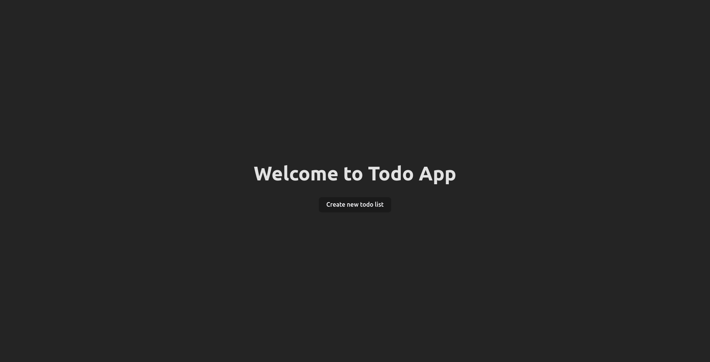
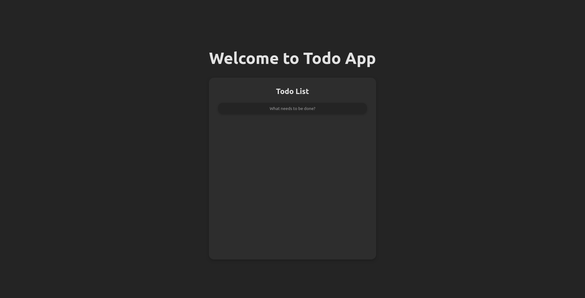
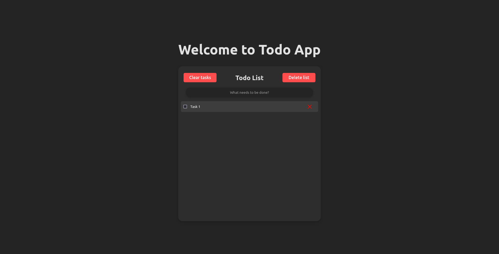
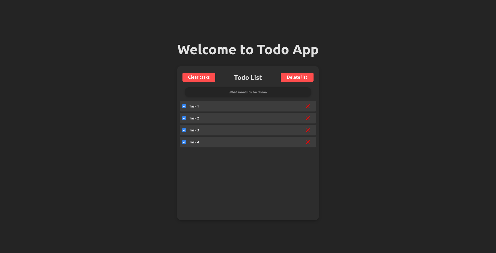

# spring-todo-app

This project is a simple Todo application built using Spring Boot for the backend and Svelte for the frontend.

## Features

- Add, edit, and delete tasks.
- Mark tasks as completed.
- Simple and intuitive user interface.

## Technologies Used

- **Backend**:
    - Spring Boot 
    - Spring Data JPA
    - Spring Web MVC
    - JUnit
    - Swagger
- **Frontend**: 
  - Svelte
- **Database**: H2 (in-memory database)

## How to Run

### Prerequisites

- Java Development Kit (JDK)
- Node.js and npm

### Clone the repository:

```bash
git clone https://github.com/mbaracz/spring-todo-app.git
```

### Backend

1. Navigate to the backend directory:

```bash
cd backend
```

2. Run the Spring Boot application:

```bash
mvn spring-boot:run
```

The backend will start running on `http://localhost:8080`.

### Frontend

1. Navigate to the frontend directory:
```bash
cd frontend
```
2. Install dependencies:
```bash
npm install
```

3. Run the Svelte application:
```bash
npm run dev
```
The frontend will start running on `http://localhost:5173`.

## Screenshots

<details>
  <summary>Click to expand</summary>





</details>

## Contributing

Contributions to the project are welcome! If you find any issues or have suggestions for improvement, please
open an issue or submit a pull request.

## License

This project is licensed under the MIT License - see the [LICENSE](LICENSE) file for details.
